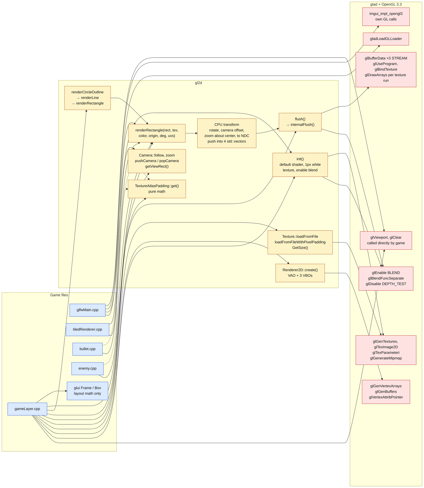
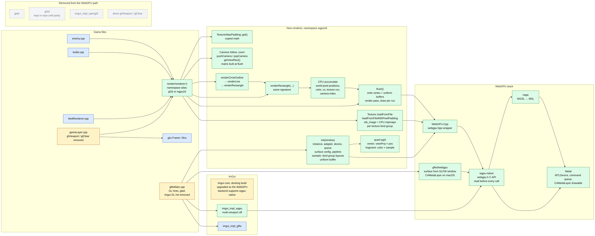
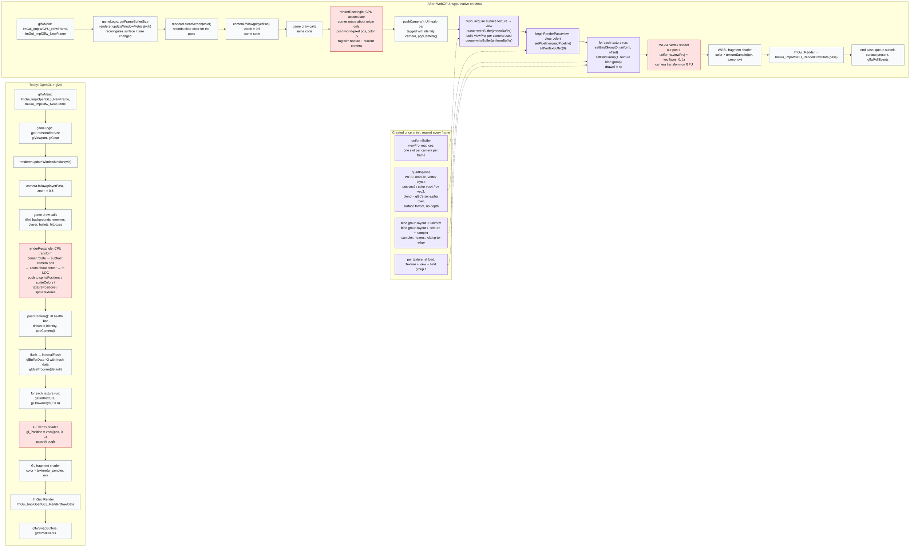

# Render port: call flow and frame lifecycle

Companion to [webgpu-port-plan.md](webgpu-port-plan.md). Three diagrams: how rendering flows today, how it will flow after the port, and what one frame looks like before and after.

Line numbers refer to the tree at commit `ac8ad97`. Diagrams render at natural size and scroll sideways rather than shrinking to fit.

## 1. Current call flow

Which game files call which gl2d entry points, and where gl2d reaches glad and OpenGL. Exact call sites are in the table under the diagram.

Call sites:

| Caller | Lines | Entry point |
|--------|-------|-------------|
| glfwMain.cpp | 333 | gladLoadGLLoader |
| glfwMain.cpp | 339 | gl2d::init |
| glfwMain.cpp | 365-366, 419, 495 | imgui_impl_opengl3 init, new frame, render |
| glfwMain.cpp | 494 | glViewport |
| gameLayer.cpp | 163-164 | glViewport, glClear |
| gameLayer.cpp | 89-90 | gl2d::init, Renderer2D::create |
| gameLayer.cpp | 166 | updateWindowMetrics |
| gameLayer.cpp | 92-113 | Texture loads, 8 textures, 2 with pixel padding |
| gameLayer.cpp | 94, 98, 412 | TextureAtlasPadding construct and get |
| gameLayer.cpp | 80, 215, 222, 492, 512 | Camera follow, zoom, pushCamera, popCamera |
| gameLayer.cpp | 500, 508 | renderRectangle, health bar |
| gameLayer.cpp | 444-483 | renderCircleOutline, hitboxes |
| gameLayer.cpp | 519 | flush |
| tiledRenderer.cpp | 8 | getViewRect |
| tiledRenderer.cpp | 21, 39 | renderRectangle |
| bullet.cpp | 24 | renderRectangle |
| enemy.cpp | 8 | renderRectangle via renderSpaceShip |

Key observations:

- Every visible primitive is a quad. Circle outlines and lines expand to rectangles before reaching the batch.
- The CPU transform box is where the camera lives today. The vertex shader is a pass-through that receives normalized device coordinates.
- Only four direct GL calls exist outside gl2d and ImGui: two `glViewport`, one `glClear`, one glad load.
- glui is on the diagram only to show it needs no port. The game uses its layout structs, never its drawing functions.

## 2. Target call flow

Same game files, new renderer namespace, WebGPU-Cpp, wgpu-native, Metal. The CMake renderer option picks which namespace the alias points at, so the OpenGL column keeps building until parity.

Legend:

| Color | Meaning |
|-------|---------|
| Blue | Unchanged. Source is identical apart from the include line and alias. |
| Amber | Edited. Logic unchanged, GL-specific lines removed or swapped for the new init and present calls. |
| Green | New. Written during the port or fetched as a dependency. |
| Gray dashed | Deleted from the WebGPU path. gl2d and glad stay in the tree until the parity check passes, then go. |

The alias header is the whole integration trick. gl2d's signatures are copied name-for-name for the subset the game calls, so `tiledRenderer.cpp`, `bullet.cpp`, and `enemy.cpp` do not change at all. The implementation under those signatures is not copied.

## 3. Frame lifecycle side by side

Left is today. Right is after the port. The two red boxes are the same job, the camera transform, moving from the CPU into a vertex shader. The purple boxes are the WebGPU objects that replace gl2d's global GL state and have no counterpart on the left.

What changes between the columns:

- **Transformation moves.** Today the camera offset, zoom, and NDC conversion all happen on the CPU inside `renderRectangle`, and the vertex shader does nothing. After the port, `renderRectangle` only rotates the quad about its own origin and stores world-pixel positions. One matrix per camera does the rest in the vertex shader.
- **Camera stack becomes a uniform slot.** gl2d's push and pop just swaps a struct that the CPU transform reads. With the camera on the GPU, each draw range has to know which matrix to use. The diagram shows one uniform buffer with a slot per camera and a dynamic offset per range. Whether to do that or break the batch and rewrite one matrix per camera change is a milestone 6b decision. Both are fine at this game's scale.
- **Global GL state becomes objects.** Blend mode, the shader program, and the vertex layout are baked into the pipeline at init. The sampler and texture binding become a bind group created once per texture at load time. Nothing is rebound by name at draw time.
- **Clear becomes part of the pass.** `glClear` at frame start becomes a load operation on the render pass, so `clearScreen` only records the color and the pass applies it in `flush`.
- **Present is explicit.** The surface texture is acquired at flush, drawn into, and presented after submit. There is no swap-buffers call, and the surface must be reconfigured on resize.
- **Buffer uploads are the same shape.** gl2d streams three fresh buffers each frame. The new renderer writes one interleaved vertex buffer each frame through the queue, growing it only when the quad count exceeds capacity.

Which milestone builds each box is covered in section 4.

## 4. Milestone dependency graph

Which milestone introduces each concept, and what each one depends on. Solid edges are hard dependencies: the later milestone reuses objects the earlier one created. The order is a real sequence, so the numbering carries meaning. Milestone details are in [webgpu-port-plan.md](webgpu-port-plan.md).

```mermaid
%%{init: {"flowchart": {"useMaxWidth": false, "htmlLabels": true, "nodeSpacing": 40, "rankSpacing": 45}, "themeVariables": {"fontSize": "16px"}}}%%
flowchart TB
    m1a["1a · Deps and adapter<br/>CMake: WebGPU-distribution, glfw3webgpu, WebGPU-Cpp<br/>renderer option, GLFW_NO_API window<br/>instance, adapter, adapter info to console"]
    m1b["1b · Clear color<br/>device, queue, surface, surface config<br/>command encoder, render pass with clear load op<br/>submit, present"]
    m2["2 · One triangle<br/>WGSL shader module, render pipeline<br/>vertex and fragment stages, color target format<br/>draw(3), vertices hardcoded in the shader"]
    m3["3 · Colored quad<br/>vertex buffer, vertex buffer layout, attributes<br/>queue.writeBuffer, draw(6), per-vertex color"]
    m4["4 · Textured quad<br/>texture, queue.writeTexture, texture view<br/>sampler, bind group layout 1, bind group<br/>textureSample, Y / UV orientation decision"]
    m5["5 · Pixel-space camera<br/>uniform buffer, bind group layout 0<br/>orthographic viewProj in the vertex shader<br/>resize → surface reconfigure, Retina framebuffer size<br/>gl2d y-down, zoom about center, follow"]
    m6a["6a · Many quads, one texture<br/>renderRectangle signature, CPU accumulate<br/>rotation about origin, world-pixel positions<br/>growable vertex buffer reused across frames<br/>gl2d blend state in the pipeline<br/>renderLine, renderCircleOutline"]
    m6b["6b · Runs across textures<br/>texture runs → draw ranges, bind group per run<br/>pushCamera / popCamera → camera index per range<br/>uniform slot per camera, dynamic offset<br/>getViewRect"]
    m7["7 · Atlas, loader, game wiring<br/>loadFromFile, loadFromFileWithPixelPadding<br/>CPU mipmaps, mip levels, mipmap filter<br/>TextureAtlasPadding, Colors_* equivalents<br/>alias header, CMake switch<br/>remove glViewport / glClear, updateWindowMetrics, clearScreen"]
    m7p["7-parity · Screenshot comparison<br/>same scene on both builds<br/>gamma, orientation, mipmap shimmer, blend"]
    m8["8 · ImGui on WebGPU<br/>upgrade ImGui, ImGui_ImplWGPU_Init<br/>NewFrame, RenderDrawData in the same pass<br/>multi-viewport off"]
    m9["9 · Text, optional<br/>stb_truetype glyph atlas<br/>glyph quads through the batch"]
    m10["10 · Render targets, optional<br/>render to an offscreen texture<br/>sample it in a second pass"]

    m1a --> m1b --> m2 --> m3 --> m4 --> m5 --> m6a --> m6b --> m7 --> m7p --> m8
    m4 -.-> m9
    m6b -.-> m9
    m1b -.-> m10
    m4 -.-> m10

    classDef learn fill:#dcfce7,stroke:#15803d,color:#111
    classDef mixed fill:#fef3c7,stroke:#b45309,color:#111
    classDef game fill:#dbeafe,stroke:#1d4ed8,color:#111
    classDef opt fill:#f3f4f6,stroke:#6b7280,color:#374151,stroke-dasharray: 5 5
    class m1a,m1b,m2,m3,m4 learn
    class m5 mixed
    class m6a,m6b,m7,m7p,m8 game
    class m9,m10 opt
```

Legend: green is pure WebGPU learning, amber is mixed, blue is game-specific, gray dashed is optional.

### Which milestone builds each box in diagram 3

| Diagram 3 box | Built in | Notes |
|---------------|----------|-------|
| a1 ImGui new frame | 8 | Swaps the OpenGL3 backend call for the WebGPU one. |
| a2 updateWindowMetrics, surface reconfigure | 1b, 5, 7 | 1b configures once. 5 reconfigures on resize. 7 wires the game's existing call to it. |
| a3 clearScreen records color | 1b, 7 | 1b has the clear load op. 7 exposes it under gl2d's name. |
| a4, a5 camera follow, game draw calls | 5, 7 | 5 ports the follow math. 7 makes the unchanged game code call it. |
| a6 CPU accumulate | 6a | The accumulate step and the rotation-about-origin rule. |
| a7 camera stack tags | 6b | Push and pop become a camera index on each range. |
| a8 write vertex and uniform buffers | 3, 5, 6a, 6b | 3 writes vertices. 5 writes one matrix. 6a grows the vertex buffer. 6b writes one matrix per camera. |
| a9 begin pass, set pipeline, set vertex buffer | 1b, 2, 3 | Pass from 1b, pipeline from 2, vertex buffer from 3. |
| a10 per-run bind groups and draw | 4, 5, 6b | Group 1 from 4, group 0 from 5, the run loop from 6b. |
| a11 WGSL vertex shader with viewProj | 2, 5 | 2 writes the module. 5 adds the matrix multiply. |
| a12 WGSL fragment shader | 2, 4 | 2 outputs a color. 4 multiplies by a texture sample. |
| a13 ImGui render into the pass | 8 | |
| a14 end pass, submit, present | 1b | |
| o1 quadPipeline | 2, 3, 6a | 2 creates it. 3 adds the vertex layout. 6a sets gl2d's blend state. |
| o2 bind group layouts and sampler | 4, 5, 7 | Layout 1 and sampler from 4. Layout 0 from 5. Mipmap filter on the sampler from 7. |
| o3 uniformBuffer | 5, 6b | 5 has one slot. 6b has one slot per camera per frame. |
| o4 per-texture bind group | 4, 7 | 4 does it once by hand. 7 does it inside the loader. |

### What each milestone delivers

**1a. Dependencies and adapter.** CMake fetches WebGPU-distribution, which pins a wgpu-native release, plus glfw3webgpu and WebGPU-Cpp, behind a renderer option that defaults off so the OpenGL build is untouched. The window is created with `GLFW_NO_API` instead of an OpenGL context. The code creates a WebGPU instance and requests an adapter, which is the handle to a physical GPU, and prints its name and backend to the console. Nothing is drawn. This is the session where the build system and the macOS Objective-C compile of glfw3webgpu get sorted out, which is why it is separate.

**1b. Clear color.** From the adapter the code requests a device, the logical connection that owns every later object, and its queue, where work is submitted. glfw3webgpu turns the GLFW window into a surface, and the surface is configured with a size and pixel format. Each frame acquires the surface's current texture, records a render pass whose load operation clears to a color, submits the command buffer, and presents. This is boxes a9 in its simplest form and a14 in full. The sRGB versus non-sRGB format decision happens here.

**2. One triangle.** A WGSL shader module holds a vertex and a fragment function. A render pipeline binds them together with the surface's color format and a triangle-list topology. The vertex positions are hardcoded in the shader, so the pass only calls set-pipeline and draw with three vertices. This is o1 in its first form and the first versions of a11 and a12. The point is to see that a pipeline is a fixed object, not mutable global state.

**3. Colored quad.** Vertex data moves into a GPU buffer. A vertex buffer layout tells the pipeline the stride and the attributes, position and color, and the shader reads them as inputs. The queue writes the buffer, the pass sets it, and the draw covers six vertices. This adds the vertex layout to o1 and creates the first versions of a8 and the set-vertex-buffer step in a9.

**4. Textured quad.** stb_image decodes a PNG, a texture is created and written through the queue, and a texture view and sampler are made. A bind group layout declares the texture and sampler slots, a bind group fills them, and the fragment shader samples with the vertex's UV. This is o2 layout 1, the first o4, the set-bind-group step in a10, and the final a12. The orientation decision is made here: keep gl2d's vertical flip at load, or drop it and use WebGPU's top-left origin directly.

**5. Pixel-space camera.** A uniform buffer holds a view-projection matrix built on the CPU from framebuffer size, camera position, and zoom. Bind group layout 0 exposes it and the vertex shader multiplies every position by it, which is the a11 box in final form. Vertex data is now in world pixels, not normalized coordinates. Resize reconfigures the surface using the framebuffer size so Retina works. gl2d's y-down convention, zoom about the screen center, and the follow function are ported here so the numbers match the old renderer. This is o3, the layout-0 half of o2, and the matrix part of a8.

**6a. Many quads, one texture.** The renderer gains gl2d's public shape: a `renderRectangle` with rect, texture, color, origin, rotation, and UVs, plus `renderLine` and `renderCircleOutline` built on it. Each call rotates the corners about the origin on the CPU and appends world-pixel positions, colors, and UVs to a vector, which is box a6. At flush the vector is written to one vertex buffer that grows only when capacity is exceeded and is otherwise reused. gl2d's blend state is set on the pipeline so alpha looks the same. Demo: hundreds of rotating sprites from one texture.

**6b. Runs across multiple textures.** The accumulator records which texture each quad used. Flush walks the list, and each run of consecutive quads sharing a texture becomes one draw with that texture's bind group, which is the a10 loop. `pushCamera` and `popCamera` return, implemented as a camera index stamped on each range. Flush writes one matrix per camera used that frame into the uniform buffer and selects it per range with a dynamic offset. `getViewRect` is ported for parallax. This completes o3, a7, and a8.

**7. Atlas, padded loader, and game wiring.** The texture type gains `loadFromFile` and `loadFromFileWithPixelPadding`, which copies gl2d's padding logic and builds the per-texture bind group inside the loader. Mipmaps are generated on the CPU since WebGPU has no generate-mipmap call. The texture descriptor declares the mip levels and the sampler gets a mipmap filter. `TextureAtlasPadding` and the color macros are copied. The alias header and CMake switch land, the two direct GL calls in `gameLayer.cpp` come out, and `updateWindowMetrics` and `clearScreen` are wired under their gl2d names. The real game draws on WebGPU without ImGui.

**7-parity. Screenshot comparison.** Both builds run the same scene with spawns off and a fixed setup. Screenshots are compared for gamma, sprite orientation, mipmap shimmer on the backgrounds, and bullet alpha. Milestone 7 is not done until this passes.

**8. ImGui on WebGPU.** The bundled ImGui is replaced with a release whose WebGPU backend compiles against the wgpu-native header in the checkout. The backend is initialized with the device and surface format, the OpenGL3 new-frame and render calls become their WebGPU equivalents, and the ImGui draw data is rendered into the same render pass after the game batch. Multi-viewport is turned off on this path. This is a1 and a13, and full-app parity.

**9. Text, optional.** stb_truetype packs glyphs into an atlas texture, and text becomes a run of quads through the existing batch. Depends on 4 for the texture path and 6b for the batch.

**10. Render targets, optional.** A second texture is created as a render target, the scene pass draws into it, and a second pass samples it to the surface. Depends on 1b for passes and 4 for sampling. Unused by the game today, useful for post-processing later.
